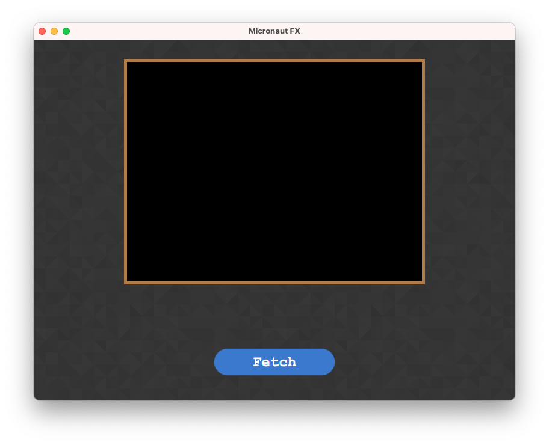
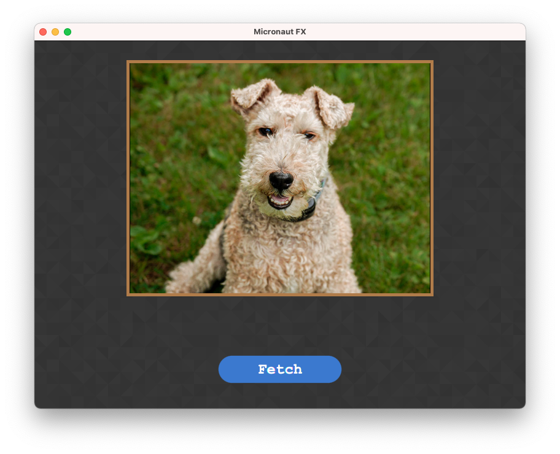

## Gluon Ignite with Micronaut DI in a JavaFX demo

A sample project using [Micronaut DI](https://docs.micronaut.io/latest/guide/#injection) and [Gluon Ignite](https://github.com/gluonhq/ignite) integrated into a [Java FX](https://openjfx.io/) demo application. Gluon Ignite in its version 1.2.3 was not compatible with Micronaut version >= 4 . The Gluon Ignite workaround you can find in the package `io.igx.fx`.

### Prerequisites
Running with e.g. Gradle 9.7.0 and JDK > 26.0.2, e.g. 26.0.2-zulu and JavaFX 26.0.2.

### Running
Via command line `./gradlew run`.

Inside IDE follow the docs on setting up JavaFX on [non-modular IDE](https://openjfx.io/openjfx-docs/) project.

## Screenshots

